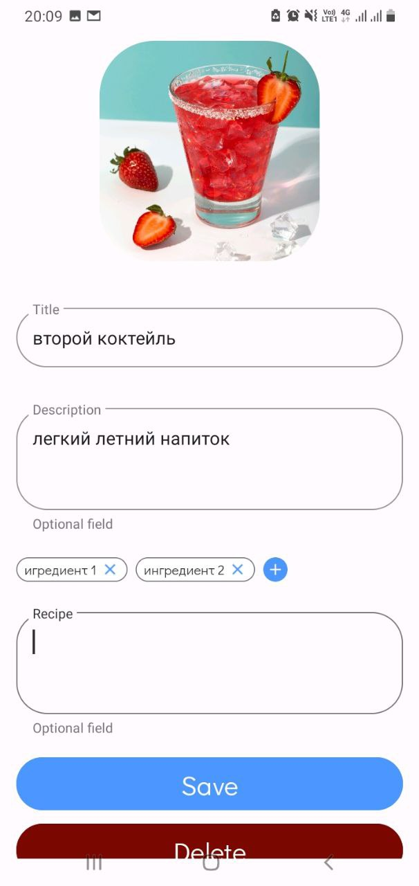
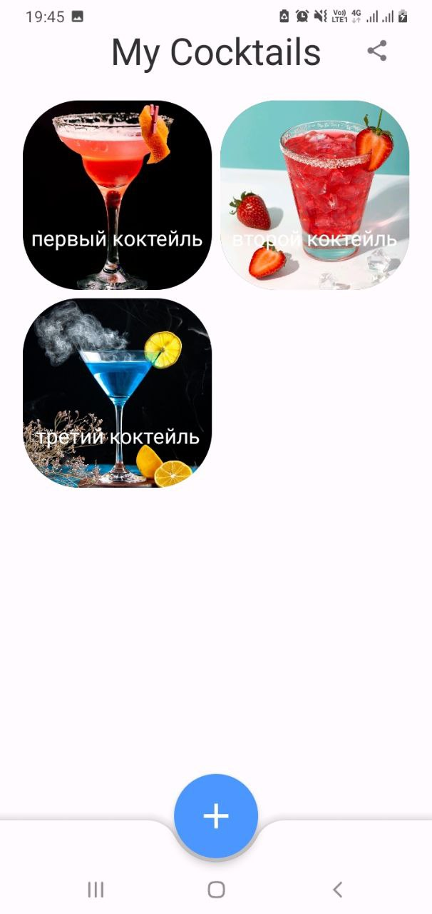
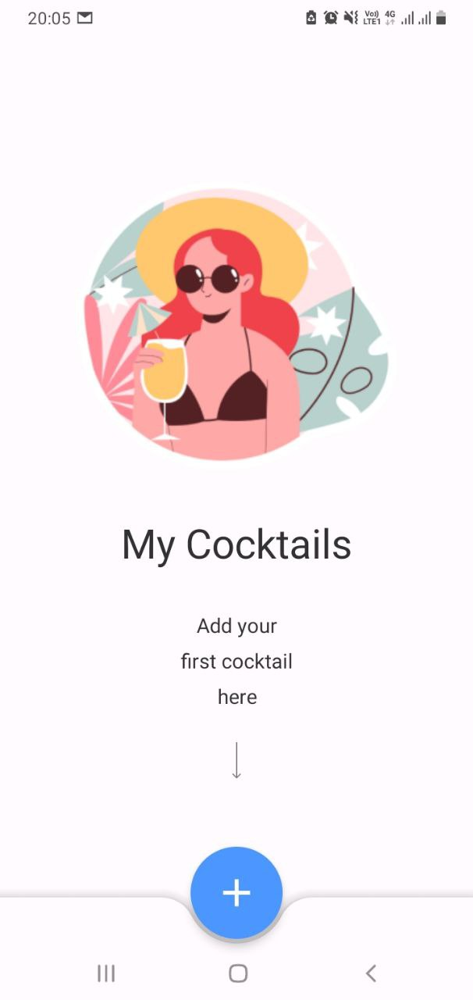
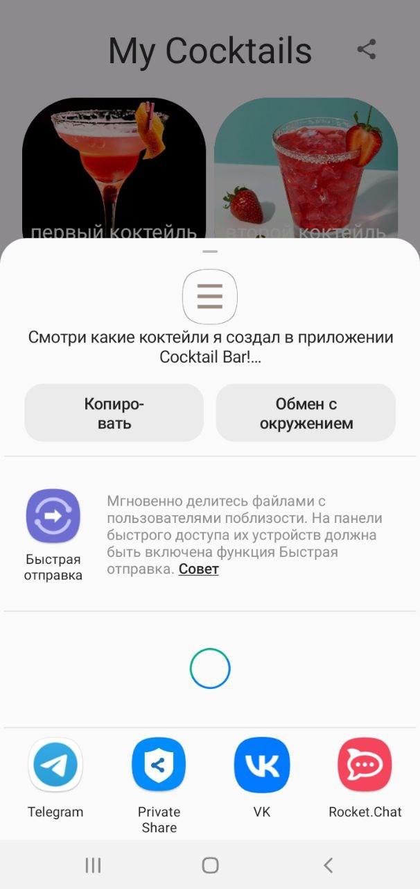
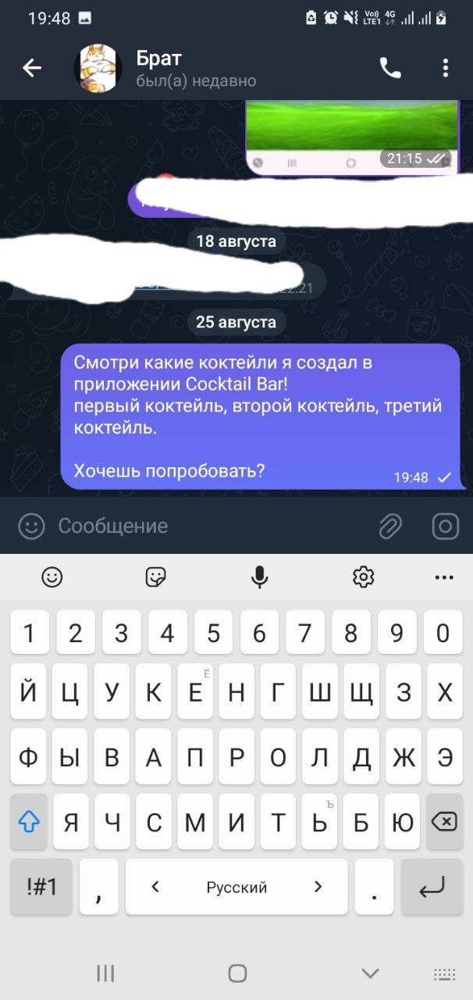
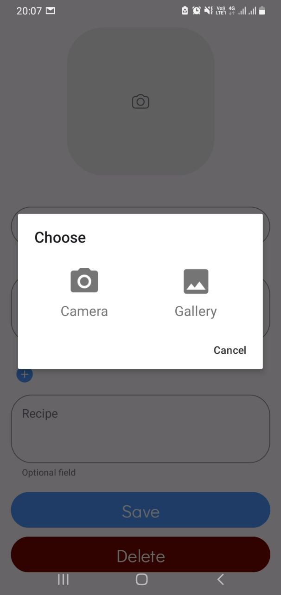
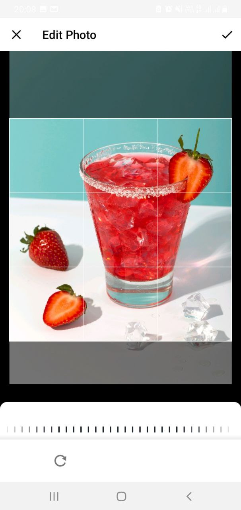
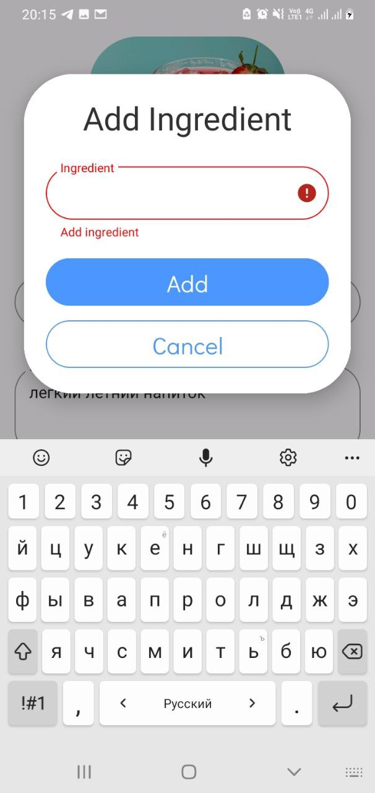
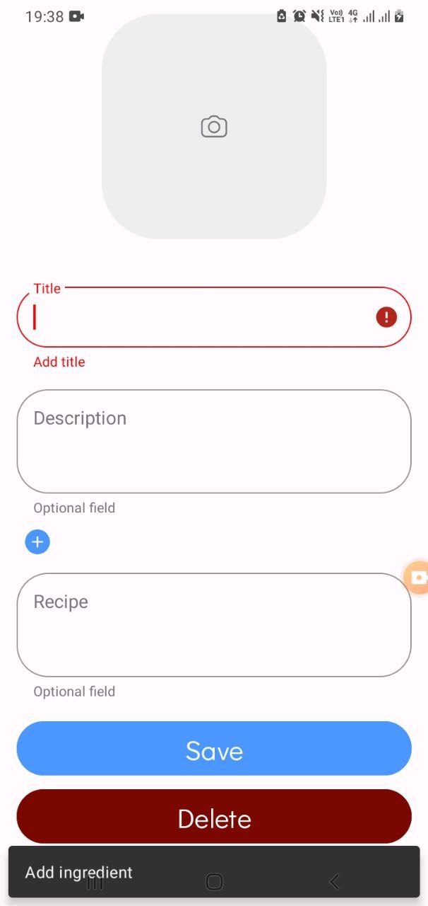
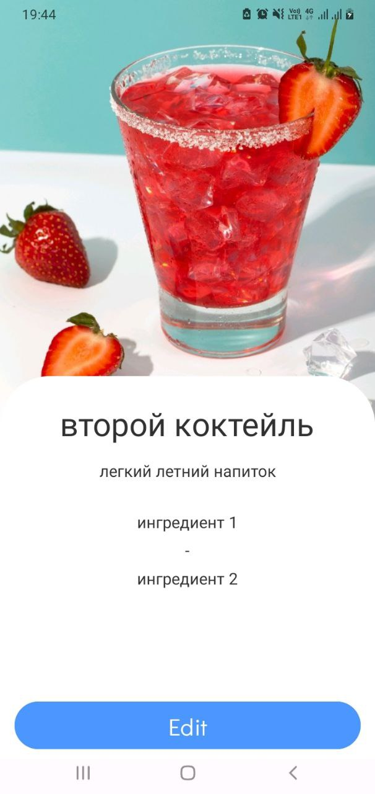

# Cocktails

Ссылка на видео работающего приложения: https://disk.yandex.com/i/UlVpm6ZkRClzzw

### Использованные технологии и паттерны:
* Room
* Navigation Component
* Koin
* Clean Architecture
* MVVM
* Многомодульность

## Экран “My Cocktails”

Коктейли пользователя хранятся локально. Подтягиваем и отображаем сохраненные пользователем коктейли.

Элементы экрана

1.	Список коктейлей 
2.	Возможность добавления нового коктейля
3.  Шаринг списка коктейлей

Список коктейлей:

* Элемент списка - изображение с названием коктейля. Если у коктейля нет изображения, отображать плейсхолдер.
* Порядок отображения выбрать на свой вкус - от старых к новым.
* По нажатию на элемент списка - переход на экран детальной информации.

Возможность добавления нового коктейля:
* FAB с плюсиком, по нажатию - переход на экран создания коктейля.
* Если список пуст, над кнопкой добавления нового коктейля отображаем текст о возможности добавить свой первый коктейль.

Шаринг списка коктейлей:
* Есть возможность поделиться списком коктейлей. 
* По нажатию на иконку шаринга открывается BottomSheet для шаринга следующего текста:  
"Смотри какие коктейли я создал в приложении Cocktail Bar! [Названия коктейлей].  
Хочешь попробовать?"

## Экран “Создание коктейля”

Экран для заполнения информации о коктейле и сохранении коктейля в свой список. 

Элементы экрана
1.	Место под загрузку изображения 
2.	Поле для ввода названия
3.	Поле для ввода описания (опциональное)
4.	Поле для ввода рецепта (опциональное)
5.	Место для списка ингредиентов
6.	Кнопка “Save”
7.	Кнопка “Delete”
8.	Кнопка “Cancel”

Загрузка изображения:

Пока изображение не загружено, в месте для загрузки изображения - плейсхолдер. По тапу - проверяем, есть ли у пользователя разрешение на доступ к медиа. Если нет, показать системный диалог для запроса разрешения. Если разрешение есть, давать пользователю возможность выбрать фото с устройства. 
Фото с устройства обрезается до квадратного, берется центральная часть.

Ввод ингредиентов

Поле с ингредиентами представляет собой chipGroup. При тапе на “+” открывается диалог ввода ингредиента. Результат добавления сохраняется в общий список в виде нового элемента.

Кнопка “Сохранить”

Сохраняем коктейль с заполненными полями (поля "Название" и "Список ингредиентов" - обязательные, остальные - опциональные).

По нажатию - валидируем данные на заполненность обязательных полей.

●	Если валидация не пройдена, подсвечиваем поля красным цветом. В случае список ингредиентов пуст- отображаем Snackbar с сообщением “Add ingredients”

●	В случае успеха, сохраняем данные о коктейле в список коктейлей и закрываем экран, возвращая пользователя на экран списка коктейлей с новым элементом.

Кнопка “Отмена”

По нажатию - возвращаемся на экран "My Cocktails" без сохранения заполненных данных.
 
## Экран “Cocktail Details”

На экране можно посмотреть подробную информацию о коктейле.

Элементы экрана
1.	Изображение - опционально, если отсутствует - отображать плейсхолдер
2.	Название
3.	Описание - опционально, если отсутствует - поле не отображать
4.	Список ингредиентов
5.	Рецепт - опционально, если отсутствует - поле не отображать
6.	Кнопка “Edit”

Список ингредиентов:

Ингредиенты перечисляются списком, каждый ингредиент в новой строчке. Между ингредиентами отображать разделитель в виде черточки.

Кнопка “Edit”

По нажатию на кнопку будет осуществляться переход к экрану “Создание коктейля” для изменения коктейля.

-	Поля для данных предзаполнены ранее заполненными данными
-	По нажатию на кнопку “Сохранить” - сохраняем изменения и закрываем экран, возвращая пользователя на экран "My Cocktails" с обновленными данными
-	По нажатию на кнопку “Отмена” - возвращаемся на экран деталки без сохранения измененных данных.

